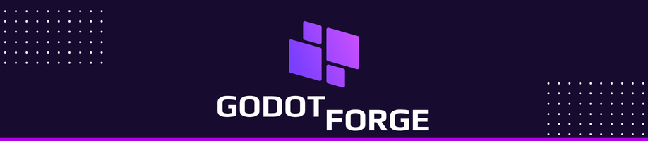

<p align="center">
  
</p>

# Godot Forge

Godot Forge is a cross-platform desktop hub for managing Godot editor installations, local project libraries, and per-project Git workflows from one polished interface.

The app is inspired by the productivity model of tools such as Unity Hub and Epic Games Launcher, while staying focused on Godot-specific workflows: editor discovery, release downloads, project creation, project launching, path management, and repository operations.

> Disclaimer: Godot Forge is an independent project by **ZEPHYRUS PROSPERITY - UNIPESSOAL LDA**. We are not affiliated, associated, authorized, endorsed by, or in any way officially connected with the Godot Engine project, the Godot Foundation, or any of their subsidiaries or affiliates. The name "Godot" is used only to identify compatibility with the Godot Engine.

## Highlights

- Cross-platform desktop application powered by Tauri, Vue 3, and TypeScript.
- Tailwind CSS 4 and DaisyUI 5 interface with dark and light theme support.
- English and Portuguese localization through JSON translation files.
- Welcome and onboarding flow for first-time setup.
- Project library with search, favorites, import, creation, and launch actions.
- Dedicated project detail page with overview, settings, Git status, recent logs, branch controls, remotes, and push operations.
- Godot editor management with local registrations, default editor selection, install paths, and executable metadata.
- GitHub release integration for official `godotengine/godot` releases.
- Automatic download, extraction, and registration of compatible Godot editor archives.
- System-aware release filtering for the current desktop platform and Mono/non-Mono variants.
- Local settings for default editor installation path, default project path, language, and DaisyUI theme.

## Tech Stack

- **Desktop shell:** Tauri 2
- **Frontend:** Vue 3, TypeScript, Vite
- **Styling:** Tailwind CSS 4, DaisyUI 5
- **Localization:** vue-i18n with JSON message files
- **Native backend:** Rust through Tauri commands
- **Version control integration:** local Git command execution per project

## Project Structure

```text
.
├── src/                 # Vue application source
├── src/assets/          # App UI assets
├── src/locales/         # JSON translation files
├── src-tauri/           # Tauri and Rust backend
├── src-tauri/icons/     # Cross-platform application icons
├── public/              # Static web assets
└── .github/assets/      # README and repository assets
```

## Requirements

- Node.js 20 or newer
- npm
- Rust stable toolchain
- Tauri system dependencies for your operating system
- Git installed and available in `PATH`

For Linux builds, make sure the required WebKitGTK and platform packages for Tauri are installed for your distribution.

## Development

Install dependencies:

```bash
npm install
```

Run the frontend development server:

```bash
npm run dev
```

Run the Tauri desktop app in development mode:

```bash
npm run tauri dev
```

Build the frontend:

```bash
npm run build
```

Build desktop bundles:

```bash
npm run tauri build
```

The Linux bundle configuration currently targets AppImage, RPM, and Debian packages.

## Local Data

Godot Forge stores local hub state in the user configuration directory.

On Linux/XDG environments, the state file is:

```text
~/.config/godot-forge/hub-state.json
```

The state file includes registered editors, project library entries, default paths, and app settings.

## Godot Release Downloads

Godot Forge queries releases from the official `godotengine/godot` GitHub repository and filters downloadable assets according to the current operating system and selected runtime variant.

Downloaded editor archives are extracted into the configured installation path and then registered as local editors.

## Git Integration

Git features are scoped per project. A project can be opened in its own detail page to inspect and manage:

- repository detection;
- `.git` initialization;
- current branch;
- branch listing, switching, and creation;
- working tree status;
- recent commit log;
- `origin` remote configuration;
- pushing the current branch.

## Branding

The Godot Forge name, logo, icon set, banners, and other brand assets are owned by **ZEPHYRUS PROSPERITY - UNIPESSOAL LDA** and are not licensed under the software license in this repository.

You may not use the Godot Forge logos, marks, or brand assets in redistributed projects, derivative applications, promotional material, or commercial products without prior written permission from ZEPHYRUS PROSPERITY - UNIPESSOAL LDA.

## Security

See [SECURITY.md](SECURITY.md) for vulnerability reporting, social engineering guidance, and credential-handling expectations.

## Privacy

Godot Forge is local-first and stores workspace data on the user's machine. See [PRIVACY.md](PRIVACY.md) for stored data categories, user controls, privacy-report behavior, and operator notes for GDPR, UK GDPR, LGPD, CCPA/CPRA, and similar frameworks.

## AI Assistance Notice

Parts of this project were developed with assistance from AI coding tools. All AI-assisted contributions are reviewed, edited, and maintained by the project authors, who remain responsible for source code, licensing, security, privacy, and release decisions.

## License

The source code is licensed under the Apache License 2.0. See [LICENSE](LICENSE).

Brand assets, logos, icons, product names, and trademarks are excluded from the Apache License grant. See [LICENSE-BRAND-ASSETS.md](LICENSE-BRAND-ASSETS.md).

Redistributions must preserve copyright notices, license notices, and the attribution information provided in [NOTICE](NOTICE).
